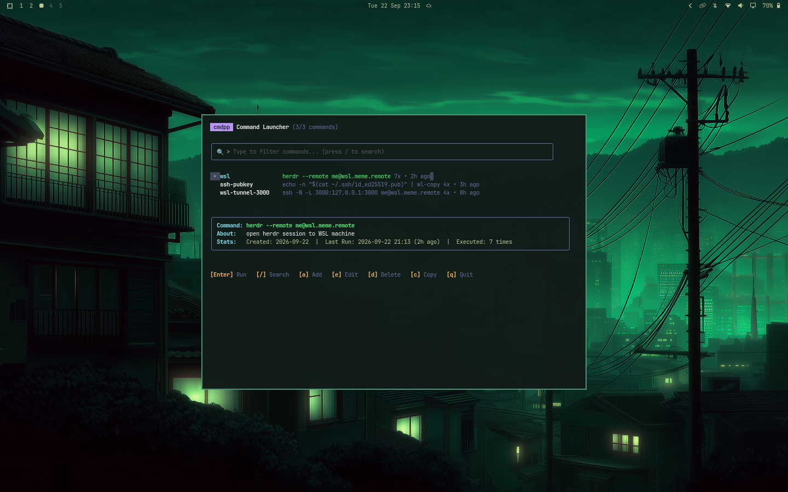

# Command++ (`yuri.cmdpp`)

A fast, keyboard-driven command palette and workflow manager plugin for [Omarchy](https://omarchy.org/) and Hyprland, wrapping the [`cmdpp`](https://github.com/hyuricane/cmdpp) TUI application.

Press **`SUPER + SHIFT + H`** to open the interactive Command++ palette anywhere on your desktop.



---

## Features

- **Global Shortcut**: Summon instantly with `SUPER + SHIFT + H`.
- **Pure TUI**: Direct wrapper around `cmdpp` BubbleTea TUI — lightweight, fast, and no duplicate GUI overhead.
- **Floating Modal Window**: Centered floating terminal window configured specifically for Hyprland.
- **Interactive & Persistent Execution**: Seamlessly run long-running commands, SSH sessions, tunnels, and interactive TUI tools without fear of accidental closure.
- **cmdpp Capabilities**:
  - Real-time search & fuzzy filtering across command names, scripts, and descriptions.
  - In-TUI command management: Add (`a`), Edit (`e`), Delete (`d` or `x`).
  - Copy command to clipboard with `c`.
  - Execution counter & last-run history tracking.
- **App Launcher Integration**: Ships with a `.desktop` entry for Omarchy's menu/app launcher (`SUPER + SPACE`).

---

## Requirements

- [Omarchy](https://omarchy.org/) Linux with Hyprland
- Standard Omarchy terminal (`foot`, `ghostty`, `alacritty`, or `kitty` via `xdg-terminal-exec`)
- `curl` or `wget` and `tar` (for automated binary download on first launch)

---

## Installation

Install using the official Omarchy tooling:
```bash
omarchy plugin add https://github.com/hyuricane/omarchy-cmdpp.git --enable
```

Add the safe keybinding loader to `~/.config/hypr/bindings.lua`:
```lua
-- Command++
local cmdpp_file = (os.getenv("HOME") or "") .. "/.config/omarchy/plugins/yuri.cmdpp/cmdpp-bindings.lua"
local cmdpp_handle = io.open(cmdpp_file, "r")
if cmdpp_handle then
  cmdpp_handle:close()
  dofile(cmdpp_file)
end
```

Reload Hyprland:
```bash
hyprctl reload
```

*(On first launch via `SUPER + SHIFT + H`, the plugin automatically downloads and verifies the immutable release artifact for your architecture using committed SHA-256 checksums).*

---

## Keyboard Shortcuts

### Global
| Shortcut | Action |
|---|---|
| `SUPER + SHIFT + H` | Open Command++ Floating Palette |

### Inside Command++ TUI
| Key | Action |
|---|---|
| `↑` / `↓` or `k` / `j` | Navigate commands |
| `Enter` | Execute selected command |
| `/` | Focus search / filter bar |
| `a` | Add new command dialog |
| `e` | Edit selected command |
| `d` or `x` | Delete selected command |
| `c` | Copy command to clipboard |
| `Esc` | Clear filter / cancel dialog |
| `q` / `Ctrl+C` | Quit Command++ |

---

## Uninstallation

```bash
omarchy plugin remove yuri.cmdpp
```
*(Remove the Command++ block from `~/.config/hypr/bindings.lua` and reload with `hyprctl reload`).*

---

## License

[MIT](LICENSE)
